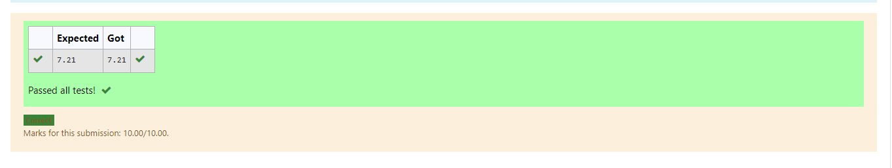

# DISTANCE-BETWEEN-TWO-POINTS

## AIM:
To write a python program to find the distance two 2 points
## ALGORITHM:
### Step 1:
Import math module
### Step 2: 
Assign values as list
### Step 3: 
Substitute the values in the distance formula  
### Step 4: 
End the program 

### PROGRAM:
``` 
#Program to find the distance between two points.
#Developed by: Senthil Kumar S
#RegisterNumber: 21500410
import math
x=[10,6]
y=[4,2]
value=math.sqrt(((x[0]-y[0])**2)+((x[1]-y[1])**2))
print("{:.2f}".format(value))
```
### OUTPUT:


### RESULT:
Thus the distance between two points is found successfully